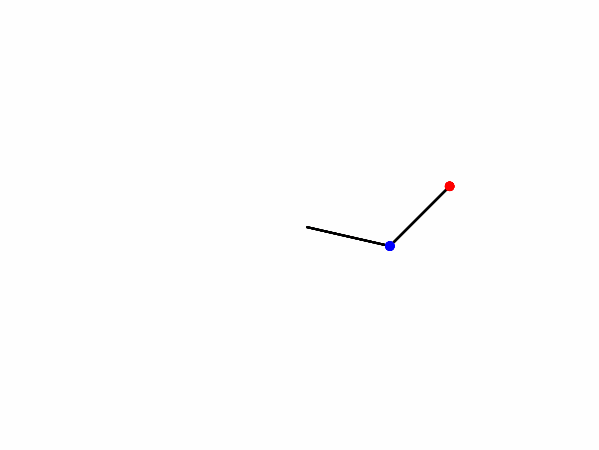

# Double-Pendulum

  Project made for an university subject (diffetential equations)

  The code creates a series of images an then build a gif with then simulating double penduluns.

  

The code was based on an tutorial found in: https://scipython.com/blog/the-double-pendulum/
